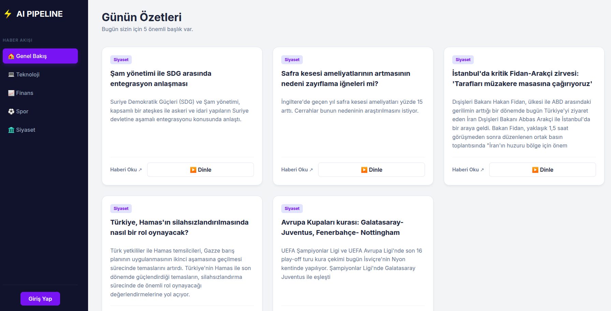
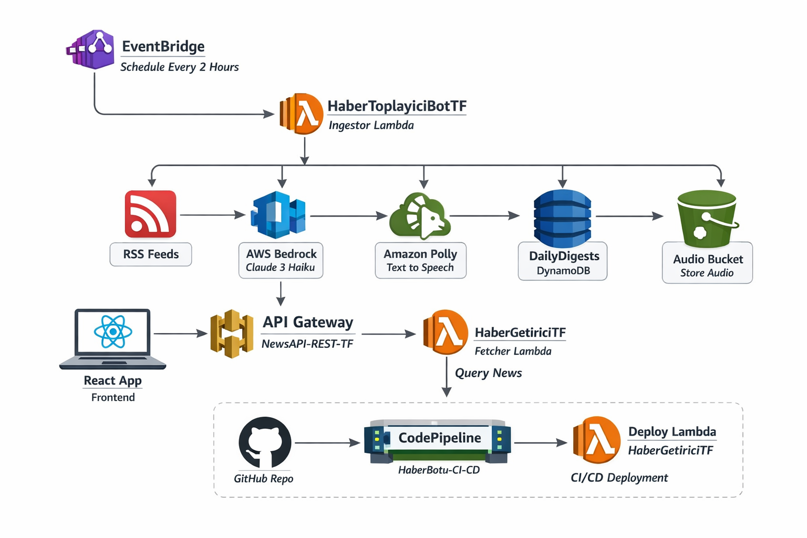

# 📰 Serverless AI Haber Botu (Terraform & AWS & React)

AWS üzerinde çalışan tamamen **sunucusuz (serverless)** bir yapay zeka haber botu ve bu botun ürettiği içerikleri sunan **React tabanlı web arayüzünden** oluşur.

Tüm altyapı **Terraform** ile yönetilir; CI/CD süreçleri ise **GitHub Actions** ve **AWS CodePipeline** üzerinden otomatik çalışır.

Bot; haberleri toplar → **AWS Bedrock** ile özetler → **AWS Polly** ile doğal insan sesiyle **podcast formatında** çıktı üretir. React arayüzü bu içerikleri kullanıcıya sunar.

---

## 🖥️ UI Preview


🏗️ AWS Architecture Overview


## 🚀 Mimari ve Teknolojiler

Bu proje aşağıdaki teknolojileri ve AWS servislerini kullanır:

* **Terraform** – Infrastructure as Code (IaC)
* **React (Vite)** – Modern, hızlı web arayüzü
* **GitHub Actions** – Otomatik CI/CD pipeline
* **AWS CodePipeline** – Lambda fonksiyonlarının sürekli dağıtımı
* **AWS Lambda** – Haber toplama ve işleme (Python)
* **AWS Bedrock** – AI ile haber özetleme
* **AWS Polly** – Metnin doğal insan sesine dönüştürülmesi
* **Amazon S3** – Ses dosyaları, web sitesi ve Terraform state
* **Amazon DynamoDB** – İşlenen haberlerin takibi (mükerrerlik önleme)
* **Amazon EventBridge** – Botun her sabah otomatik tetiklenmesi

---

## 📂 Proje Yapısı

```
.
├── .github/workflows/      # GitHub Actions (CI/CD)
├── news-terraform/         # Terraform altyapı kodları
│   ├── main.tf             # AWS kaynakları
│   ├── api.tf         # CI/CD tanımları
│   ├── dynamodb.tf         # CI/CD tanımları
│   ├── lambda.tf         # CI/CD tanımları
│   ├── outputs.tf         # CI/CD tanımları
│   ├── pipeline.tf         # CI/CD tanımları

│   └── src/             # Python bot kodları
│       ├── ingestor.py     # Test edilecek ana bot dosyası
│       └── ...
├── haber-sitesi/               # React Web Uygulaması
│   ├── src/
│   ├── package.json
│   └── ...
└── README.md               # Proje dokümantasyonu
```


## 📜 Lisans

Bu proje **MIT Lisansı** ile lisanslanmıştır.

---

